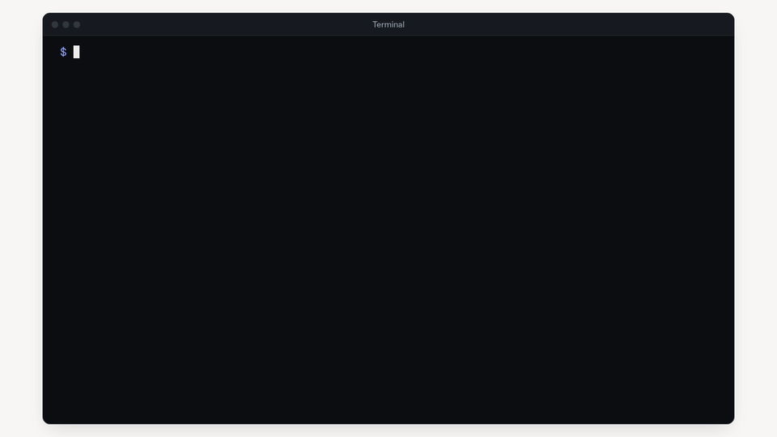

<div align="center">

# RigorRun

**Your agent moves money. You're checking it by reading the transcript.**

RigorRun gives your agent support tickets, then reads Stripe itself — your test mode, or a local
twin with no keys — and shows what actually happened beside what the agent said it did. Open
source, runs on your machine, no account.

[rigorrun.xyz](https://rigorrun.xyz) · [Documentation](https://docs.rigorrun.xyz) · [A recorded run, case by case](https://rigorrun.xyz/replay) · [npm](https://www.npmjs.com/package/rigorrun)

</div>

<p align="center">
  <a href="https://rigorrun.xyz/media/demo.mp4"></a>
</p>

```bash
npx rigorrun demo
```

Replays a recorded run offline: what the agent said, beside what the system held afterwards. No
keys, no account. The same run is at [rigorrun.xyz/replay](https://rigorrun.xyz/replay).

## Your Stripe agent, no code changes

```bash
npx rigorrun stripe twin                                   # a local Stripe twin; leave it running
npx rigorrun stripe init --twin --yes                      # the Stripe pack's tickets, as a project
npx rigorrun agent add --project <id> --name my-agent \
  --black-box <agent URL> --claim-path message             # your agent's endpoint, as it runs today
npx rigorrun gate --project <id> --report report.html      # exit 1 when a case fails
```

No change to your agent's code: RigorRun sends each ticket to the endpoint your agent already
serves (map your request shape with `--body-template`; `--claim-path` names the field its answer's
sentence is in) and reads Stripe itself. Your agent keeps its own Stripe test key — or, for the
local twin, its Stripe base URL points at the twin. The verdict comes from what Stripe holds, never
from what the agent said. Every verdict is `PARTIAL`
and prints what was read. Against your Stripe test mode, `stripe init` takes a test key instead of
`--twin` — live keys are refused. Start with [the Stripe guide](https://docs.rigorrun.xyz/start/stripe)
and [the example agent](examples/stripe-support-agent); CI is one step
(`uses: Konuktor/rigorrun@v0.4.0`, see [docs/CI.md](docs/CI.md)).

**How we know the verdicts are right.** Before this release the Stripe pack was qualified against a
protocol written before any code: 8 scripted agents (1 correct, 7 with one defect each) × 7 tickets ×
3 attempts, each verdict checked against an independent oracle that reads Stripe directly. On the
local twin and on Stripe test mode: 168 and 168 cells, no false pass and no false fail. Black-box
mode on its own system: 36 cells, none either.
([Stripe evidence](reports/stripe-pack-2026-10) · [black-box evidence](reports/blackbox-qualification-2026-10))

Not on Stripe? This opens a local interface for any system RigorRun can reach and read back — an
MCP server, an HTTP API, or a web application:

```bash
npx rigorrun
```

---

This is the development repository. If you want to _use_ RigorRun, the commands above are the whole
install and [the documentation](https://docs.rigorrun.xyz) is the place to start. What follows is
for people working on it.

## Why it is public

`rigorrun` is published to npm by a GitHub Actions workflow that holds no npm token, using npm
trusted publishing, and carries a SLSA build provenance attestation. That attestation names this
repository and the commit it was built from. Provenance pointing at a source nobody can read proves
very little, so this stays public and the internal material lives elsewhere. See
[docs/REPOSITORY_ARCHITECTURE.md](docs/REPOSITORY_ARCHITECTURE.md).

## Layout

```
apps/site        rigorrun.xyz — Astro, static, one document per route
apps/app         the interface the runner serves; ships inside the npm package
apps/docs        docs.rigorrun.xyz — Astro Starlight
apps/demo-crm    Northstar Support: a synthetic system for the bundled example
apps/demo-ops    four synthetic schema-driven systems
apps/extension   the Chrome recorder

packages/design  design tokens, type system and logo, shared by all three sites
packages/cli     the published `rigorrun` package
packages/daemon  the local runner: HTTP API, pairing, project store
packages/core    the domain types — contracts, cases, runs, assertions, records
packages/env-*   how RigorRun reaches a system: MCP, OpenAPI, browser
packages/sandbox `rigorrun verify` — container isolation and conformance
...              compiler, generator, runner, verifier, scoring, quality, report

fixtures/external  a system and an agent that import nothing from RigorRun
```

`apps/site` and `apps/app` were one bundle until 0.3. That meant every visitor to the website
downloaded the entire product UI and every person running `npx rigorrun` downloaded the landing
page. They share `packages/design` and nothing else.

## Working on it

```bash
pnpm install && pnpm start   # build the interface, then run the runner
pnpm dev                     # the interface and both demo systems, watching
```

`pnpm rigorrun` alone would leave you with a working API and no interface, which is why the first
line builds before it serves.

## Gates

```bash
pnpm release:verify       # everything below, in order, on this machine
```

|                                                         |                                                                     |
| ------------------------------------------------------- | ------------------------------------------------------------------- |
| `pnpm lint` · `pnpm typecheck`                          | the usual                                                           |
| `pnpm test`                                             | 847 unit tests                                                      |
| `pnpm contrast`                                         | every token pair against its WCAG requirement                       |
| `pnpm domain`                                           | no business noun in generic code, across 26 directories             |
| `pnpm e2e` · `pnpm a11y` · `pnpm visual` · `pnpm cross` | the interface                                                       |
| `pnpm e2e:external`                                     | **a stranger connects their own system and their own agent**        |
| `pnpm e2e:restart`                                      | SIGKILL survival, and a damaged file reported rather than dropped   |
| `pnpm verify:package`                                   | clean-room install of the tarball, then the full journey against it |
| `pnpm gate1`                                            | clean machine → a verification record, one command, no browser      |
| `pnpm contact`                                          | whether the addresses the site publishes can receive mail           |

Two of these matter more than the rest. `e2e:external` and `verify:package` measure whether somebody
who has never seen this source can use RigorRun; everything else measures whether RigorRun works on
material that ships inside RigorRun. **A release where only the second kind is green is not a
release.**

## Three rules

The product's argument is that you should check claims rather than believe them, so it does not get
to make unverifiable ones about itself.

1. **No user-visible number is a literal.** Counts come from generated JSON, regenerated by a script
   and checked in CI. The site once claimed 18 events, 17 cases and 10 categories while the pipeline
   produced 7, 22 and 9.
2. **Nothing claims a check that did not run.** `DECLARED` isolation exists because `RESET` used to
   mean "a reset was configured" rather than "the reset was observed to work".
3. **A limitation is documented, not omitted.** `untested` is a required field on a verification
   record: a record that omits what it could not reach is not a cleaner record, it is a false one.

## Releasing

Tag `v*` and the Release workflow publishes with provenance. It verifies the tag matches the
manifest and runs `verify:package` first. See [docs/RELEASING.md](docs/RELEASING.md).

## Contributing

[CONTRIBUTING.md](CONTRIBUTING.md). Security reports: [.github/SECURITY.md](.github/SECURITY.md) —
not through issues.

---

MIT · Built by Erbol Tahirov
