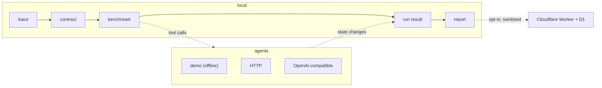

# Architecture

## The shape of the system

One decision drives everything: **expensive execution happens on the user's
machine; the cloud, if used at all, holds metadata.**

That is not only a cost decision. The recording of how a company works is the
sensitive artefact, and the safest place for it is the machine that made it.
Keeping compute local is what makes "$0 to run" and "private by default" the
same design rather than competing ones.



## The five stages

```
reset → seed → execute → observe → verify → score
```

Every case builds a **new** environment from its scenario seed. There is no
shared mutable world, so no case can inherit state from another — asserted by
test, not by convention.

| Stage            | Where                 | What it does                                                      |
| ---------------- | --------------------- | ----------------------------------------------------------------- |
| `reset` / `seed` | `@rigorrun/northstar` | Builds a fresh world from one scenario, plus any injected fault   |
| `execute`        | `@rigorrun/runner`    | Hands the agent the _public_ case view and a bounded tool channel |
| `observe`        | `@rigorrun/northstar` | Reads back real state, the action log, and a derived projection   |
| `verify`         | `@rigorrun/verifier`  | Evaluates the case's private checks against that observation      |
| `score`          | `@rigorrun/scoring`   | Rates, Wilson intervals, latency percentiles, pass@k, thresholds  |

## Why the environment is a state machine, not a browser

The Northstar CRM is a pure TypeScript state machine with no Node built-ins.
The identical module runs in the clickable CRM, in the dashboard, in the CLI and
in CI. That buys four things at once:

- A 17-case, 2-agent benchmark finishes in about a second, so it is usable as a
  pre-commit gate rather than a nightly job.
- Results are reproducible: a logical clock means two runs of the same case
  produce identical timestamps and identical state hashes.
- The dashboard executes the real benchmark in the browser, so `pnpm demo`
  needs no backend at all.
- The workflow a human records in the CRM and the workflow an agent is tested
  on are backed by the same implementation.

Browser-driven execution is a roadmap item, not a regression: the case format
already carries `element_exists`, `url_matches` and `http_status` assertions for
it.

## The rule that makes the engine work

**The engine enforces referential integrity. It never enforces business policy.**

You cannot refund an order that does not exist — that is integrity. You _can_
refund $500 with no approval, refund the same order twice, refund an order
belonging to someone else, or refund a cancelled order. If the engine blocked
those, RigorRun would have nothing to catch.

Policy lives in the contract and is checked by the verifier against the state
the agent left behind. A test asserts each of those unsafe operations succeeds
at the engine level, so this cannot be "fixed" by accident.

## Benchmark integrity

`BenchmarkCase.task` is everything the agent may see. `BenchmarkCase.checks` is
the private verifier configuration. They are separate types, the runner builds
agent input only through `publicCaseView()`, and a test drives a spy agent
through a full run and asserts that no assertion id, target or kind appears
anywhere in what the agent received.

The benchmark is hashed before execution and the result is sealed with its own
hash afterwards, so a result can always be tied to the exact cases that produced
it.

## The derived projection

The verifier is generic; the questions are domain-specific. The bridge is
`derived` — a mechanical projection of real state that joins refunds to their
orders, tickets and approvals:

```ts
derived.createdRefunds[(amount > 50) & (approvalStatus != approved)]; // must not exist
derived.refundsForTargetOrder; // must be <= 1
```

`derived` computes facts, never judgements. Whether a fact constitutes a
violation is decided by an assertion from the contract.

One subtlety worth stating: ticket properties in `derived` are read from the
_seed_, not the final state. An agent that legitimately refunds and then
resolves the ticket must not be punished for the ticket no longer being open at
the moment we look.

## Packages

| Package     | Depends on                 | Purpose                                                                         |
| ----------- | -------------------------- | ------------------------------------------------------------------------------- |
| `core`      | zod                        | Versioned schemas, canonical-JSON SHA-256, redaction, selector ranking, logging |
| `northstar` | core                       | The synthetic CRM: state, 17 scenarios, 12 tools, observation builder           |
| `compiler`  | core                       | Trace → contract, with provenance and open questions                            |
| `generator` | core, northstar            | Contract → cases, expectations computed from the policy                         |
| `verifier`  | core                       | Path language + 14 assertion kinds                                              |
| `scoring`   | core                       | Rates, Wilson intervals, percentiles, pass@k, thresholds, verdict               |
| `agents`    | core, northstar, providers | Demo pair, HTTP adapter, OpenAI-compatible adapter                              |
| `providers` | core                       | Offline / Groq / Gemini / Workers AI / any OpenAI-compatible                    |
| `runner`    | most of the above          | Orchestration and the immutable run snapshot                                    |
| `report`    | core, scoring              | Self-contained HTML, publish sanitiser                                          |
| `cli`       | all                        | The `rigorrun` binary                                                           |

Packages are consumed from TypeScript source through path aliases. There is no
build step between them, so the code that runs in the browser, in the CLI and in
CI is the same code, not three compiled copies that can drift.

## Cost model

| Component                          | Runs on                             | Cost        |
| ---------------------------------- | ----------------------------------- | ----------- |
| Demo, CLI, benchmark, verification | Your machine                        | $0          |
| Dashboard and demo CRM             | Your browser                        | $0          |
| Recorder                           | Your browser                        | $0          |
| CI gate                            | GitHub free runners, offline agents | $0          |
| Control plane (optional)           | Workers Free + D1 Free              | $0          |
| Model-backed agents (optional)     | Your key, your quota                | Your choice |

Nothing in the required path can generate a bill. See
[COST_GUARDRAILS.md](COST_GUARDRAILS.md).
