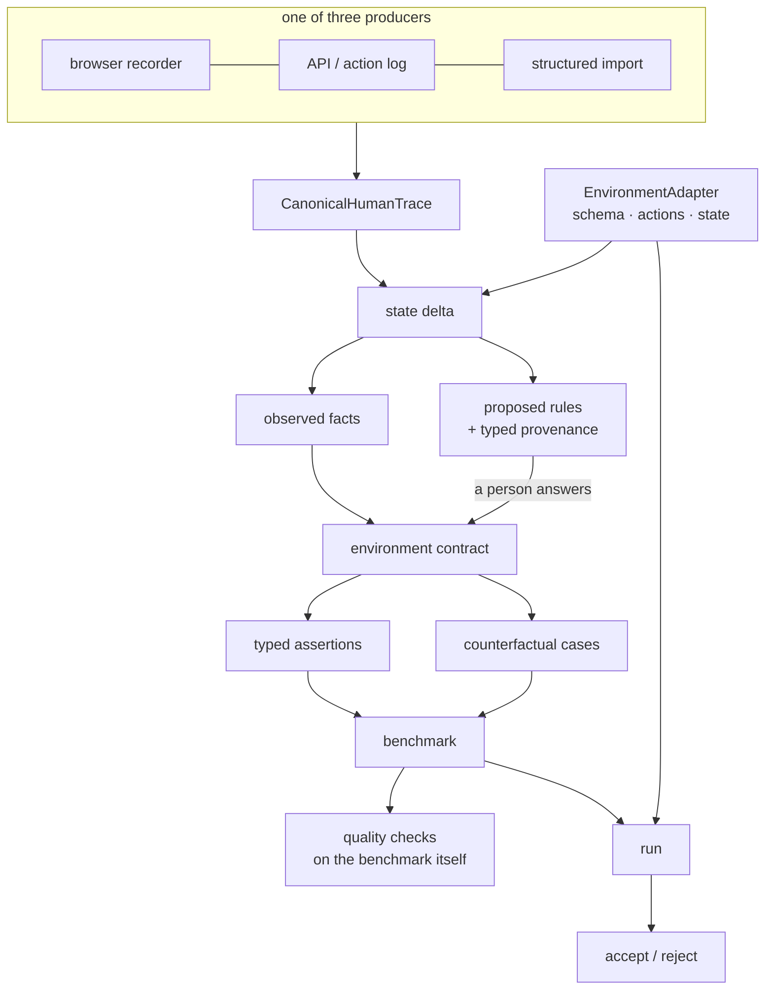

# Architecture

## The one decision

**The input is a demonstration, not a dataset.**

Everything else follows. A person does the job once; RigorRun reads the system
before and after, works out what changed, proposes what that might mean, asks,
and turns the answers into an executable suite.

The second decision, which makes the first survivable: **nothing that compiles
or verifies a benchmark is allowed to know what business it is looking at.**
That is enforced by a build check, not by discipline.

## Packages

| Package | Knows about | Purpose |
| --- | --- | --- |
| `core` | nothing domain-specific | Schemas, canonical trace, rule lifecycle, provenance, predicates, hashing, redaction |
| `environment` | nothing domain-specific | The adapter SDK, canonical state, the delta engine, the generic projection, the conformance kit |
| `compiler` | nothing domain-specific | Demonstration → contract; contract → typed assertions |
| `generator` | nothing domain-specific | Mutation primitives, expected outcomes, benchmark assembly |
| `verifier` | nothing domain-specific | Path language, 14 assertion kinds, tri-state results |
| `scoring` | nothing domain-specific | Rates, Wilson intervals, percentiles, thresholds |
| `runner` | nothing domain-specific | reset → seed → execute → observe → verify → score |
| `quality` | nothing domain-specific | Grading the benchmark: defects, controls, replay, isolation |
| `report` | nothing domain-specific | Self-contained HTML, publish sanitiser |
| `agents` | nothing domain-specific | Two generic demo agents, HTTP and OpenAI-compatible adapters |
| `environments` | **five business workflows** | Adapters, fixtures and recordings. The only place a domain lives |
| `cli` | orchestration | The `rigorrun` binary |

`pnpm domain` fails the build if a business noun appears in the code (not the
comments) of any package in the first group.

## The projection, and why it exists

Assertions need to ask joined questions: was the order this refund names owned
by the customer the refund names; was the ticket open when work began. The
previous version of this product answered those with a `derived` object a human
hand-wrote per domain — which is exactly why its "generic" verifier only ever
worked on refunds.

`buildProjection` computes the same class of facts from the declared schema:

- rows created, changed and deleted, and the world as it was at seed time
- related rows hoisted onto the row that names them, two hops out
- the same rows as they were when work began (`seed__…`)
- agreement between two paths that reach the same kind of record
- differences between two numbers measured in the same unit (`cmp__…`)
- counts, event ordinals and ordering
- whether an append-only entry references what was created

Three properties it is responsible for:

**Determinism.** Keys are generated in a fixed order. Object key order is a
real source of nondeterminism and replay stability depends on there being none.

**A published key schema.** Every path an assertion may use is enumerated, and
the compiler hard-fails on anything else. A path the verifier cannot resolve
does not fail — it silently *passes*, forever — and machine-generated paths get
that wrong in whole families at a time.

**Bounded size.** Rooted only at what the demonstration touched plus what any
action can write to, two hops deep, role-tagged fields only, with a hard
ceiling and a diagnostic if it is hit.

## Observed, inferred, confirmed

The distinction is the product, so it is a type rather than a label.

- `observed` — in the state delta. Deterministic.
- `inferred` — RigorRun generalised. Compiles to non-blocking checks.
- `confirmed` — a person said yes. Blocking.
- `rejected` — a person said no. Kept, not deleted.

Only `observed` and `confirmed` produce release-blocking assertions, asserted by
test. Rejected rules are kept because they are the cheapest honest control
available: a defect that violates one must *survive* the benchmark.

## Expected outcomes

The obvious implementation is wrong in a way that looks fine. Rules are
conditions on the world *after* the work, so evaluating them against a case's
starting state satisfies all of them vacuously, marks every case as one the
agent should proceed with, and produces a suite with no negative cases that
reports full coverage.

Instead: seed the case, execute the demonstrated plan through the adapter,
project the result, evaluate, and roll back. The adapter already has snapshot
and restore, so this costs nothing beyond the execution. Expectations go
through the same synthesis and verification path the benchmark uses, so the two
cannot drift.

## The rule that makes environments work

**An environment enforces referential integrity. It never enforces business
policy.**

You cannot refund an order that does not exist — that is integrity. You *can*
refund one you should not have. If the environment blocked that, every agent
would pass and the benchmark would measure nothing. RigorRun verifies this by
executing each confirmed rule's violation against the adapter, and drops rules
the environment already enforces with a warning.

## Benchmark integrity

`BenchmarkCase.task` is everything the agent sees. `checks` and `referencePlan`
are private. The runner builds agent input only through `publicCaseView`, and
the quality check adds the property that matters more: **every case carries an
identical policy brief**, so its wording cannot hint at the verdict.

## Cost model

Unchanged, and still the reason it works: expensive execution happens on your
machine, the cloud holds metadata if you opt in, and nothing in the required
path can generate a bill or a network request.
